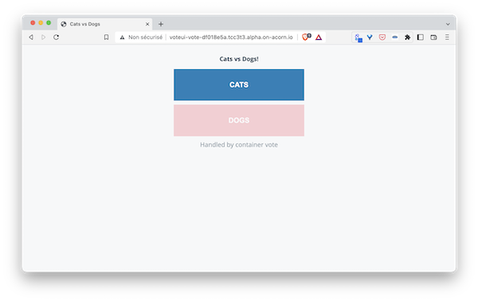

## Defining the application in an Acornfile

As described in the documentation, an Acornfile contains the following top level elements:

- args: defines arguments the consumer can provide
- profiles: defines a set of default arguments for different deployment types
- containers: defines the containers to run the application
- volumes: defines persistent storage volumes for the containers to consume
- jobs: defines tasks to run on changes or via cron
- acorns: other Acorn applications that need to be deployed with your app
- secrets: defines secret bits of data that are automatically generated or passed by the user
- localData: default data and configuration variables
- routers: support path based HTTP routing to expose multiple containers through a single published service

To represent the microservices of the VotingApp, create an Acornfile in the *votingapp* folder. This file should only contains the *containers* top level key and an empty element for each microservice as follows:

```
containers: {
  voteui: {
  }
 
  vote: {
  }
 
  redis: {
  }
 
  worker: {
  }
 
  db: {
  }
 
  result: {
  }
 
  resultui: {
  }
}
```

As the microservice will run in containers, we need to specify how the containers can be built or which image it is based on:

- for the vote-ui, vote, worker, result and result-ui microservices we use the *build.context* property to reference the location of the Dockerfile that will be used to build the image
- for db and redis we specify the image property

Make sure the Acornfile now looks as follows:

```
containers: {
 voteui: {
   build: {
     context: "./vote-ui"
   }
 }
 
 vote: {
   build: {
     context: "./vote"
   }
 }
 
 redis: {
   image: "redis:6.2-alpine3.13"
 }
 
 worker: {
   build: {
     context: "./worker/go"
   }
 }
 
 db: {
   image: "postgres:13.2-alpine"
 }
 
 result: {
   build: {
     context: "./result"
   }
 }
 
 resultui: {
   build: {
     context: "./result-ui"
   }
 }
}
```

For the postgres image to run we need to provide it the POSTGRES_PASSWORD environment variable. In this example we also define the POSTGRES_USER. 

The definition of the db container is as follows:

```
db: {
   image: "postgres:13.2-alpine"
   env: {
     "POSTGRES_USER": "postgres"
     "POSTGRES_PASSWORD": "postgres"
   }
}
```

As result needs to connect to db, we specify the credentials in that container too:

```
result: {
   build: "./result"
   ports: "5000/http"
   env: {
     "POSTGRES_USER": "postgres"
     "POSTGRES_PASSWORD": "postgres"
   }
}
```

as worker also communicates with db we also give it the credentials it needs:

```
worker: {
   build: "./worker/go"
   env: {
     "POSTGRES_USER": "postgres"
     "POSTGRES_PASSWORD": "postgres"
   }
 }
```

Note: in the next step we’ll show how to use Acorn secrets to avoid to specify the password in the plain text

In order for the container of the application to communicate with each other we need to define the network ports for each one. As defined in the documentation, there are 3 scopes to specify the ports:

- internal allows communication between containers within the same Acorn app
- expose allows communication between containers within the cluster
- publish allows containers to be reached from outside of the cluster

As vote, result, redis and db microservices only need to be reachable from other containers within the same application, we use the default internal scope for each of them.

As vote-ui and result-ui need to be reachable from the outside world we use the publish scope for both of them.

Make sure your Acornfile now looks as follows:

```
containers: {
 voteui: {
   build: "./vote-ui"
   ports: publish : "80/http"
 }
 
 vote: {
   build: "./vote"
   ports: "5000/tcp"
 }
 
 redis: {
   image: "redis:6.2-alpine3.13"
   ports: "6379/tcp"
 }
 
 worker: {
   build: "./worker/go"
   env: {
     "POSTGRES_USER": "postgres"
     "POSTGRES_PASSWORD": "postgres"
   }
 }
 
 db: {
   image: "postgres:13.2-alpine"
   ports: "5432/tcp"
   env: {
     "POSTGRES_USER": "postgres"
     "POSTGRES_PASSWORD": "postgres"
   }
 }
 
result: {
   build: "./result"
   ports: "5000/http"
   env: {
     "POSTGRES_USER": "postgres"
     "POSTGRES_PASSWORD": "postgres"
   }
 }
 
 resultui: {
   build: "./result-ui"
   ports: publish : "80/http"
 }
}
```

You now have a first (minimal) version of the Acornfile which specifies the application. Let’s make sure the Voting App can be run using that one.

## Testing the application

Run the VotingApp using Acorn cli:

```
acorn run -n vote .
```

It takes a couple of minutes for the application to be up and running (all the containers will be built first). When it’s ready you should be returned the http endpoints on the *acorn.io* domain for both vote-ui and result-ui containers:

Your endpoints should have the same format as the following ones (the identifiers will be different though):

- vote-ui : http://voteui-vote-df018e5a.tcc3t3.alpha.on-acorn.io

- result-ui: http://resultui-vote-df018e5a.tcc3t3.alpha.on-acorn.io

You can now access the Vote UI, select your favorite pet, then make sure your vote has been taken into account accessing the result UI.




Using the following command you can visualize all the acorn resources created:

```
acorn all
```

It should return a result similar to the following one:

```
APPS:
NAME      IMAGE          HEALTHY   UP-TO-DATE   CREATED    ENDPOINTS                                                                                                                                  MESSAGE
vote      fd93b8cee56a   7         7            102s ago   http://resultui-vote-df018e5a.tcc3t3.alpha.on-acorn.io => resultui:80, http://voteui-vote-df018e5a.tcc3t3.alpha.on-acorn.io => voteui:80   OK

CONTAINERS:
NAME                             APP       IMAGE                                                                     STATE     RESTARTCOUNT   CREATED    MESSAGE
vote.db-5c889d664d-jrpk9         vote      postgres:13.2-alpine                                                      running   0              101s ago
vote.redis-69dd5f96b-q5tds       vote      redis:6.2-alpine3.13                                                      running   0              101s ago
vote.result-597866986d-pt75z     vote      sha256:b681183b16eabcec15e7602a91f99fed952a6581b6ebb687423e2d453182c16c   running   0              101s ago
vote.resultui-6cbdcb456d-r64w8   vote      sha256:f1eb21ca12459fcfb6593f734fc2cabc916aeabb6b1d39741974f88c188b3555   running   0              101s ago
vote.vote-54f5b9fc8b-v9bb8       vote      sha256:46c25d82668eb381050cf28497674ac5a6e024869c3adcd13d0853ad88cfd36f   running   0              101s ago
vote.voteui-fb6bf5685-lxmj7      vote      sha256:99efc7281e2d3b564a1aa69fd8b259e91e71efdc5d71a23ee2562a2541e7119b   running   0              101s ago
vote.worker-66b5564f6-fxkps      vote      sha256:5eed60ebd2a755d89f7c787e6cb5056052f0c1c1e416ea22022ef74578c1be00   running   0              101s ago

VOLUMES:
NAME      APP-NAME   BOUND-VOLUME   CAPACITY   STATUS    ACCESS-MODES   CREATED

SECRETS:
ALIAS     NAME      TYPE      KEYS      CREATED
```

The application’s containers have been created and exposed. Currently there are no secrets nor volumes as we did not defined those top level elements in the Acornfile (yet).

<details>
  <summary markdown="span">If you are curious about...</summary>

...what happened under the hood, we could see that a new Kubernetes namespace has been created in the cluster, this one is dedicated to our newly created acorn application:

```
$ kubectl get ns
NAME                STATUS   AGE
NAME                STATUS   AGE
default             Active   20m
kube-system         Active   20m
kube-public         Active   20m
kube-node-lease     Active   20m
acorn               Active   19m
acorn-system        Active   19m
vote-df018e5a-eef   Active   2m10s <- namespace created for the application
```

Within this namespace there are a Deployment / Pod and a Service for each microservice of the Voting App:

```
$ kubectl get all -n vote-df018e5a-eef
NAME                            READY   STATUS    RESTARTS   AGE
pod/redis-69dd5f96b-q5tds       1/1     Running   0          2m53s
pod/worker-66b5564f6-fxkps      1/1     Running   0          2m53s
pod/resultui-6cbdcb456d-r64w8   1/1     Running   0          2m53s
pod/voteui-fb6bf5685-lxmj7      1/1     Running   0          2m53s
pod/vote-54f5b9fc8b-v9bb8       1/1     Running   0          2m53s
pod/result-597866986d-pt75z     1/1     Running   0          2m53s
pod/db-5c889d664d-jrpk9         1/1     Running   0          2m53s

NAME               TYPE        CLUSTER-IP      EXTERNAL-IP   PORT(S)    AGE
service/db         ClusterIP   10.43.136.35    <none>        5432/TCP   2m53s
service/redis      ClusterIP   10.43.8.226     <none>        6379/TCP   2m53s
service/result     ClusterIP   10.43.67.222    <none>        5000/TCP   2m53s
service/resultui   ClusterIP   10.43.110.102   <none>        80/TCP     2m53s
service/vote       ClusterIP   10.43.211.188   <none>        5000/TCP   2m53s
service/voteui     ClusterIP   10.43.61.251    <none>        80/TCP     2m53s

NAME                       READY   UP-TO-DATE   AVAILABLE   AGE
deployment.apps/redis      1/1     1            1           2m53s
deployment.apps/worker     1/1     1            1           2m53s
deployment.apps/resultui   1/1     1            1           2m53s
deployment.apps/voteui     1/1     1            1           2m53s
deployment.apps/vote       1/1     1            1           2m53s
deployment.apps/result     1/1     1            1           2m53s
deployment.apps/db         1/1     1            1           2m53s

NAME                                  DESIRED   CURRENT   READY   AGE
replicaset.apps/redis-69dd5f96b       1         1         1       2m53s
replicaset.apps/worker-66b5564f6      1         1         1       2m53s
replicaset.apps/resultui-6cbdcb456d   1         1         1       2m53s
replicaset.apps/voteui-fb6bf5685      1         1         1       2m53s
replicaset.apps/vote-54f5b9fc8b       1         1         1       2m53s
replicaset.apps/result-597866986d     1         1         1       2m53s
replicaset.apps/db-5c889d664d         1         1         1       2m53s
```

On top of that, an Ingress resource has been created so the web interfaces (vote-ui and result-ui) can be exposed through the cluster’s Ingress Controller (Traefik in our setup):

```
$ kubectl get ingress -n vote-df018e5a-eef
NAME       CLASS    HOSTS                                             ADDRESS         PORTS   AGE
resultui   <none>   resultui-vote-df018e5a.tcc3t3.alpha.on-acorn.io   192.168.205.2   80      3m41s
voteui     <none>   voteui-vote-df018e5a.tcc3t3.alpha.on-acorn.io     192.168.205.2   80      3m41s
```
</details>

You can then remove the application:

```
acorn rm vote
```

Wait a couple of seconds and make sure the list of acorn resources is now empty:

```
acorn all
```

Note: you can find more information about Acornfile in [Authoring Acornfile](https://docs.acorn.io/authoring)

[Previous](./votingapp.md)  
[Next](./secret.md)
