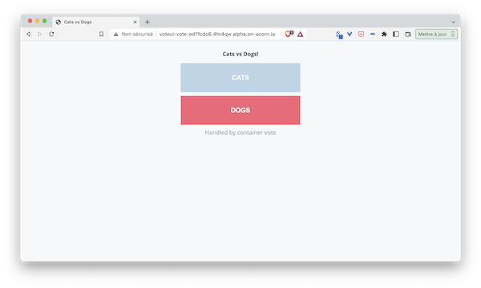
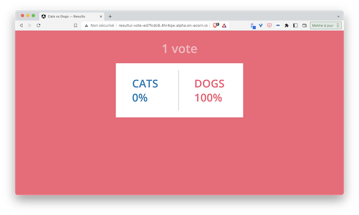

In the previous step we enhanced the Acornfile of the VotingApp and added Acorn secrets inside of it. In this article we will add a storage definition for both redis and Postgres containers so we can persist their data.

As a reminder, below is the Acornfile we defined up till now:

```
containers: {
  
  voteui: {
    build: "./vote-ui"
    ports: publish : "80/http"
  }

  vote: {
    build: "./vote"
    ports: "5000/http"
  }

  redis: {
    image: "redis:7.0.5-alpine3.16"
    ports: "6379/tcp"
  }

  worker: {
    build: "./worker/go"
    env: {
     "POSTGRES_USER": "secret://db-creds/username"
     "POSTGRES_PASSWORD": "secret://db-creds/password"
    }
  }

  db: {
    image: "postgres:15.0-alpine3.16"
    ports: "5432/tcp"
    env: {
     "POSTGRES_USER": "secret://db-creds/username"
     "POSTGRES_PASSWORD": "secret://db-creds/password"
    }
  }

  result: {
    build: "./result"
    ports: "5000/http"
    env: {
     "POSTGRES_USER": "secret://db-creds/username"
     "POSTGRES_PASSWORD": "secret://db-creds/password"
   }
  }

  resultui: {
    build: "./result-ui"
    ports: publish : "80/http"
  }
}

secrets: {
    "db-creds": {
        type: "basic"
        data: {
            username: ""
            password: ""
        }
    }
}
```

Both db and redis containers are databases but as we didn’t specify any storage related properties, the data of each container are stored in the file system of the container. This means that when a container is deleted and recreated the data is lost. This is usually fine in a development environment but definitely not what we want in production. 

## About Acorn volumes

To ensure data is persisted for both containers we will use Acorn volumes. As we have done in the post dedicated to secrets, we can define volumes using acorn cli or directly in the Acornfile. We will see both approaches in the following.

Note: Acorn volumes is an abstraction above Kubernetes volumes resources which are PersistentVolume and PersistentVolumeClaim. For volume to be created with Acorn a StorageClass must exists in the underlying Kubernetes cluster.

Note: If you follow along this series of tutorials you need to ensure the Kubernetes cluster you are using has a default StorageClass defined. In case you use a k3s cluster you're all set as k3s has a default StorageClass (based on the local path provisioner)

# Defining volumes in the Acornfile

Volumes is another top level key we can use in an Acornfile. It allows to define storage that will be referenced by the containers which need it. For our needs we define 2 différent volumes, one for each databases of the VotingApp. The following shows how those volumes are defined using the default StorageClass existing in the cluster

```
volumes: {
    "db": {
        size: 100M
    }
    "redis": {
        size: 100M
    }
}
```

Note: by default a volume is created using the default StorageClass, a size of 10G and a "readWriteOnce" access mode. This can be customized to one needs using the dedicated properties. 

Once defined in the *volumes* top level key, we need to mount each volumes in the corresponding container knowing that:
- postgres persists its data in */var/lib/postgresql/data*
- redis persists its data in */data*

The *db* container could then be modified into:

```
  db: {
    image: "postgres:15.0-alpine3.16"
    ports: "5432/tcp"
    env: {
     "POSTGRES_USER": "secret://db-creds/username"
     "POSTGRES_PASSWORD": "secret://db-creds/password"
    }
    dirs: {
      "/var/lib/postgresql/data*": "volume://db"
    }
  }
```

the *redis* one into:

```
redis: {
    image: "redis:7.0.5-alpine3.16"
    ports: "6379/tcp"
    dirs: {
      "/data": "volume://redis"
    }
  }
```

The Acornfile should now look like the following:

```
containers: {
  
  voteui: {
    build: "./vote-ui"
    ports: publish : "80/http"
  }

  vote: {
    build: "./vote"
    ports: "5000/http"
  }

  redis: {
    image: "redis:7.0.5-alpine3.16"
    ports: "6379/tcp"
    dirs: {
      "/data": "volume://redis"
    }
  }

  worker: {
    build: "./worker/go"
    env: {
     "POSTGRES_USER": "secret://db-creds/username"
     "POSTGRES_PASSWORD": "secret://db-creds/password"
    }
  }

  db: {
    image: "postgres:15.0-alpine3.16"
    ports: "5432/tcp"
    env: {
     "POSTGRES_USER": "secret://db-creds/username"
     "POSTGRES_PASSWORD": "secret://db-creds/password"
    }
    dirs: {
      "/var/lib/postgresql/data*": "volume://db"
    }
  }

  result: {
    build: "./result"
    ports: "5000/http"
    env: {
     "POSTGRES_USER": "secret://db-creds/username"
     "POSTGRES_PASSWORD": "secret://db-creds/password"
   }
  }

  resultui: {
    build: "./result-ui"
    ports: publish : "80/http"
  }
}

secrets: {
    "db-creds": {
        type: "basic"
        data: {
            username: ""
            password: ""
        }
    }
}

volumes: {
    "db": {
        size: 100M
    }
    "redis": {
        size: 100M
    }
}
```

Run the application:

```
acorn run -n vote .
```

As in the previous step, you should be returned the http endpoints used to access both vote-ui and result-ui frontend.

```
STATUS: ENDPOINTS[http://resultui-vote-ed7fcdc6.4hr4qw.alpha.on-acorn.io => resultui:80, http://voteui-vote-ed7fcdc6.4hr4qw.alpha.on-acorn.io => voteui:80] HEALTHY[7] UPTODATE[7] OK
```

You can then access the vote-ui, vote for your favorite pet and see the result:





If you curious to see what happened under the hood, you can see 2 PersistentVolume have been created

```
TODO
```

In this part we have defined the volumes in the Acornfile. When running the application we can change the configuration of the volume right from the command line as we will see in the next part.

## Defining volumes from the acorn cli

From the cli it's possible to specify the caracteristics of a volume already defined in the Acornfile. For instance, the following command runs the application specifying 200M of storage for each volume (instead of the 100M specified in the Acornfile)

```
acorn run -v db,size=200M -v redis,size=200M .
```

# Introducing the dev mode


