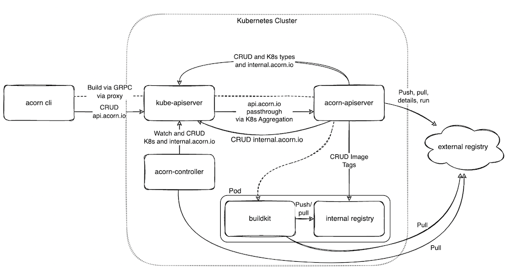
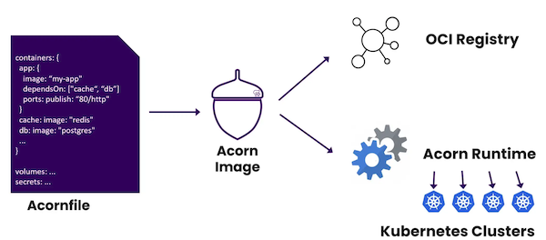

## About Acorn

When you develop a microservices application, chances are you are already familiar with Docker and are likely using Docker Compose to deploy the entire application on your local machine. When you need to deploy the application on Kubernetes it can be daunting especially if you are not familiar with this orchestrator. Indeed, it is first necessary to understand many Kubernetes concepts, to be aware of the existing resources (Pod, Deployment, Service, …) before knowing how to specify your application in yaml files or even as a Helm chart.

Acorn is a new project defined as an application deployment framework for Kubernetes. It uses a simple format to specify an application running in containers allowing the application to be run, packaged and distributed in any environment and deployed to Kubernetes without needing to know much about it.

The following schema from Acorn documentation give a high level view of Acorn’s internals:



It defines 4 components:

- acorn cli is the client binary which runs commands against the Acorn server side components
- api server manages application lifecycle based on the requests received by the CLI
- controller translates Acorn apps into Kubernetes resources
- buildkit and internal registry are used to build Acorn images and to store them internally

Before deploying an application with acorn, we need to specify this one in an Acornfile. This file describes how to build, develop, and run containerized applications.



As described in the documentation, an Acornfile contains the following top level elements:

- args: defines arguments the consumer can provide
- profiles: defines a set of default arguments for different deployment types
- containers: defines the containers to run the application
- volumes: defines persistent storage volumes for the containers to consume
- jobs: defines tasks to run on changes or via cron
- acorns: other Acorn applications that need to be deployed with your app
- secrets: defines secret bits of data that are automatically generated or passed by the user
- localData: default data and configuration variables
- routers: support path based HTTP routing to expose multiple containers through a single published service
- services: cloud services that will be provisioned for an application

The authoring Acornfile documentation gives examples of all the fields available. An Acornfile can be very simple, for instance the one below defines a simple container running the ghost image.

```
containers: {
 ghost: {
  image: "ghost:4"
  ports: publish: "2368/http"
 }
}
```

Of course the Acornfile format can easily embrace the complexity of a real-world multi-containers application using the higher-level elements listed above.

In this workshop, we will use a sample application and show how it can be handled with Acorn. Doing so we will study in details the structure of an Acornfile.

[Previous](../README.md)  
[Next](./environment.md)