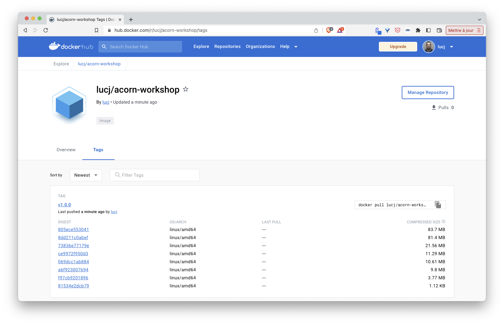

The VotingApp is now defined in an Acornfile which specifies:
- the application's containers
- a secret to connect to the *db* container
- 2 volumes to persist data for both *db* and *redis* containers
- we also added a couple of labels to the whole application

We will now use another feature of Acorn which allows us to package the app as a single artifact and push it to an OCI registry ([DockerHub](https://hub.docker.com]) in this example).

## Publishing to Docker Hub

First use the ```acorn login``` command to log into the Docker Hub (use your own DockerHub credentials or create them if you don't have a DockerHub account yet):

Note: in the commands below replace YOUR_DOCKERHUB_USERNAME with your real username

```
acorn login docker.io
```

Next build the application using the following command, this will result into the creation of a single OCI image:

```
acorn build -t docker.io/YOUR_DOCKERHUB_USERNAME/acorn-workshop:v1.0.0 .
```

Then push it to the registry:

```
acorn push docker.io/YOUR_DOCKERHUB_USERNAME/acorn-workshop:v1.0.0
```

Verify the image now exists in the DockerHub:



Your version of the VotingApp is now available in the DockerHub and it can be used by anyone using the following command:

```
acorn run -n vote docker.io/YOUR_DOCKERHUB_USERNAME/acorn-workshop:v1.0.0 .
```

[Previous](./constraints.md)  
[Next](./upgrade.md)