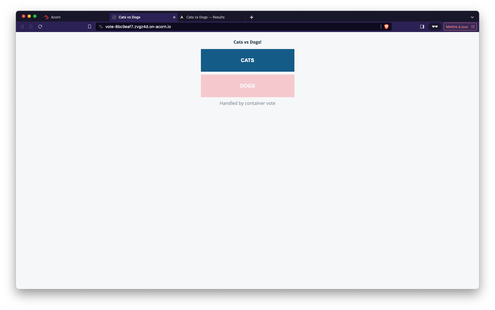

## Defining the application in an Acornfile

As described in the documentation, an Acornfile contains the following top level elements:

- args: defines arguments the consumer can provide
- profiles: defines a set of default arguments for different deployment types
- containers: defines the containers to run the application
- volumes: defines persistent storage volumes for the containers to consume
- jobs: defines tasks to run on changes or via cron
- acorns: other Acorn applications that need to be deployed with your app
- secrets: defines secret bits of data that are automatically generated or passed by the user
- localData: default data and configuration variables
- routers: support path based HTTP routing to expose multiple containers through a single published service
- services: cloud services that will be provisioned for an application

To represent the microservices of the VotingApp, create an Acornfile in the *votingapp* folder.  
This file should only contain the *containers* top level key and an empty element for each microservice as follows:

```
containers: {
  voteui: {
  }
 
  vote: {
  }
 
  redis: {
  }
 
  worker: {
  }
 
  db: {
  }
 
  result: {
  }
 
  resultui: {
  }
}
```

As the microservice will run in containers, we need to specify either how the containers can be built or the image it is based on:

- for *voteui*, *vote*, *worker*, *result* and *resultui* microservices we use the *build.context* property to reference the location of the Dockerfile which will be used to build the image
- for *db* and *redis* we specify the image property

Make sure the Acornfile now looks as follows:

```
containers: {
 voteui: {
   build: {
     context: "./vote-ui"
   }
 }
 
 vote: {
   build: {
     context: "./vote"
   }
 }
 
 redis: {
   image: "redis:6.2-alpine3.13"
 }
 
 worker: {
   build: {
     context: "./worker/go"
   }
 }
 
 db: {
   image: "postgres:13.2-alpine"
 }
 
 result: {
   build: {
     context: "./result"
   }
 }
 
 resultui: {
   build: {
     context: "./result-ui"
   }
 }
}
```

For the postgres image to run we need to provide it the *POSTGRES_PASSWORD* environment variable. In this example we also define the *POSTGRES_USER*. 

The definition of the *db* container is as follows:

```
db: {
   image: "postgres:13.2-alpine"
   env: {
     "POSTGRES_USER": "postgres"
     "POSTGRES_PASSWORD": "postgres"
   }
}
```

As *result* needs to connect to *db*, we specify the credentials in that container too:

```
result: {
   build: "./result"
   ports: "5000/http"
   env: {
     "POSTGRES_USER": "postgres"
     "POSTGRES_PASSWORD": "postgres"
   }
}
```

as *worker* also communicates with *db* we give it the credentials it needs:

```
worker: {
   build: "./worker/go"
   env: {
     "POSTGRES_USER": "postgres"
     "POSTGRES_PASSWORD": "postgres"
   }
 }
```

Note: in the next step we’ll show how to use Acorn secrets to avoid to specify the password in plain text

In order for the containers of the application to communicate with each others we need to define the network ports for each one. As defined in the documentation, there are 3 scopes to specify the ports:

- **internal** allows communication between containers within the same Acorn app
- **expose** allows communication between containers within the cluster
- **publish** allows containers to be reached from outside of the cluster

As *vote*, *result*, *redis* and *db* microservices only need to be reachable from other containers within the same application, we use the **internal** scope (default one) for each of them.

As *voteui* and *resultui* need to be reachable from the outside world we use the **publish** scope for both of them.

Make sure your Acornfile now looks as follows:

```
containers: {
 voteui: {
   build: "./vote-ui"
   ports: publish : "80/http"
 }
 
 vote: {
   build: "./vote"
   ports: "5000/tcp"
 }
 
 redis: {
   image: "redis:6.2-alpine3.13"
   ports: "6379/tcp"
 }
 
 worker: {
   build: "./worker/go"
   env: {
     "POSTGRES_USER": "postgres"
     "POSTGRES_PASSWORD": "postgres"
   }
 }
 
 db: {
   image: "postgres:13.2-alpine"
   ports: "5432/tcp"
   env: {
     "POSTGRES_USER": "postgres"
     "POSTGRES_PASSWORD": "postgres"
   }
 }
 
result: {
   build: "./result"
   ports: "5000/http"
   env: {
     "POSTGRES_USER": "postgres"
     "POSTGRES_PASSWORD": "postgres"
   }
 }
 
 resultui: {
   build: "./result-ui"
   ports: publish : "80/http"
 }
}
```

You now have a first (minimal) version of the Acornfile which specifies the application. We will now use it to build and run the VotingApp.

## Testing the application

Use the following command to run the application:

```
acorn run -n vote .
```

It will take a couple of minutes for the application to be up and running (all the containers need to be built first).  
When it’s ready you should be returned the http endpoints (on the *oss-acorn.io* domain) to access both *voteui* and *resultui* containers.

Your endpoints should have the same format as the following ones (the identifiers will be different though):

- voteui : http://voteui-vote-c7bc34b6.hchioq.oss-acorn.io 

- resultui: http://resultui-vote-f1825499.hchioq.oss-acorn.io

You can now access the Vote UI, select your favorite pet, then make sure your vote has been taken into account accessing the result UI.




Using the following command you can visualize all the acorn resources created:

```
acorn all
```

It should return a result similar to the following one:

```
ACORNS:
NAME      IMAGE          COMMIT    CREATED   ENDPOINTS                                                                                            MESSAGE
vote      cc56311d80b5             60s ago   http://resultui-vote-f1825499.hchioq.oss-acorn.io, http://voteui-vote-c7bc34b6.hchioq.oss-acorn.io   OK

CONTAINERS:
NAME                             ACORN     IMAGE                  STATE     RESTARTCOUNT   CREATED   MESSAGE
vote.db-7d4fcf5d86-zk482         vote      postgres:13.2-alpine   running   0              60s ago   
vote.redis-5cffc5447-4w69w       vote      redis:6.2-alpine3.13   running   0              60s ago   
vote.result-5dddc56bc7-f6sbj     vote      f61b8d4f1f94           running   0              60s ago   
vote.resultui-779c8db4d7-5r5zk   vote      c9094cad0edb           running   0              60s ago   
vote.vote-664b7879bd-h7kv8       vote      607c526631de           running   0              60s ago   
vote.voteui-9cb594fd5-zgfvx      vote      f4dfdb714098           running   0              60s ago   
vote.worker-d885fcfc7-z6s4n      vote      14635cdd2e51           running   0              60s ago   

VOLUMES:
NAME      BOUND-VOLUME   CAPACITY   VOLUME-CLASS   STATUS    ACCESS-MODES   CREATED

SECRETS:
NAME      TYPE      KEYS      CREATED
```

The application’s containers have been created and exposed. Currently there are no secrets nor volumes as we did not define those top level elements in the Acornfile (yet).

<details>
  <summary markdown="span">If you are curious about...</summary>

...what happened under the hood, we could see that a new Kubernetes namespace has been created in the cluster, this one is dedicated to our newly created acorn application:

```
$ kubectl get ns
NAME                  STATUS   AGE
kube-system           Active   12m
kube-public           Active   12m
kube-node-lease       Active   12m
default               Active   12m
acorn-system          Active   12m
acorn-image-system    Active   12m
acorn                 Active   12m
vote-acorn-52bb1784   Active   4m37s <- namespace created for the application
```

Within this namespace there are a Deployment / Pod and a Service for each microservice of the Voting App:

```
$ kubectl get all -n vote-acorn-52bb1784
NAME                            READY   STATUS    RESTARTS   AGE
pod/worker-d885fcfc7-z6s4n      1/1     Running   0          5m15s
pod/redis-5cffc5447-4w69w       1/1     Running   0          5m15s
pod/voteui-9cb594fd5-zgfvx      1/1     Running   0          5m15s
pod/resultui-779c8db4d7-5r5zk   1/1     Running   0          5m15s
pod/vote-664b7879bd-h7kv8       1/1     Running   0          5m15s
pod/db-7d4fcf5d86-zk482         1/1     Running   0          5m15s
pod/result-5dddc56bc7-f6sbj     1/1     Running   0          5m15s

NAME               TYPE        CLUSTER-IP      EXTERNAL-IP   PORT(S)    AGE
service/db         ClusterIP   10.43.21.70     <none>        5432/TCP   5m15s
service/resultui   ClusterIP   10.43.186.154   <none>        80/TCP     5m14s
service/result     ClusterIP   10.43.19.20     <none>        5000/TCP   5m14s
service/redis      ClusterIP   10.43.92.168    <none>        6379/TCP   5m14s
service/vote       ClusterIP   10.43.227.153   <none>        5000/TCP   5m14s
service/voteui     ClusterIP   10.43.98.246    <none>        80/TCP     5m14s

NAME                       READY   UP-TO-DATE   AVAILABLE   AGE
deployment.apps/worker     1/1     1            1           5m15s
deployment.apps/redis      1/1     1            1           5m15s
deployment.apps/resultui   1/1     1            1           5m15s
deployment.apps/voteui     1/1     1            1           5m15s
deployment.apps/vote       1/1     1            1           5m15s
deployment.apps/db         1/1     1            1           5m15s
deployment.apps/result     1/1     1            1           5m15s

NAME                                  DESIRED   CURRENT   READY   AGE
replicaset.apps/worker-d885fcfc7      1         1         1       5m15s
replicaset.apps/redis-5cffc5447       1         1         1       5m15s
replicaset.apps/voteui-9cb594fd5      1         1         1       5m15s
replicaset.apps/resultui-779c8db4d7   1         1         1       5m15s
replicaset.apps/vote-664b7879bd       1         1         1       5m15s
replicaset.apps/db-7d4fcf5d86         1         1         1       5m15s
replicaset.apps/result-5dddc56bc7     1         1         1       5m15s
```

On top of that, an Ingress resource has been created so the web interfaces (*voteui* and *resultui*) can be exposed through the cluster’s Ingress Controller (Traefik in our setup):

```
$ kubectl get ingress -n vote-acorn-52bb1784
NAME                    CLASS     HOSTS                                        ADDRESS         PORTS   AGE
resultui-acorn-domain   traefik   resultui-vote-f1825499.hchioq.oss-acorn.io   192.168.205.2   80      5m55s
voteui-acorn-domain     traefik   voteui-vote-c7bc34b6.hchioq.oss-acorn.io     192.168.205.2   80      5m55s
```
</details>

You can then remove the application:

```
acorn rm vote
```

Wait a couple of seconds and make sure the list of acorn resources is now empty:

```
acorn all
```

<details>
  <summary markdown="span">Acornfile you should have at the end of this step...</summary>
<pre>
containers: {
  voteui: {
    build: "./vote-ui"
    ports: publish : "80/http"
  }
  vote: {
    build: "./vote"
    ports: "5000/tcp"
  }
  redis: {
    image: "redis:6.2-alpine3.13"
    ports: "6379/tcp"
  }
  worker: {
    build: "./worker/go"
    env: {
      "POSTGRES_USER": "postgres"
      "POSTGRES_PASSWORD": "postgres"
    }
  }
  db: {
    image: "postgres:13.2-alpine"
    ports: "5432/tcp"
    env: {
      "POSTGRES_USER": "postgres"
      "POSTGRES_PASSWORD": "postgres"
    }
  }
  result: {
    build: "./result"
    ports: "5000/http"
    env: {
      "POSTGRES_USER": "postgres"
      "POSTGRES_PASSWORD": "postgres"
    }
  }
  resultui: {
    build: "./result-ui"
    ports: publish : "80/http"
  }
}
</pre>
</details>

Note: you can find more information about Acornfile in [Authoring Acornfile](https://docs.acorn.io/authoring)

[Previous](./votingapp.md)  
[Next](./ops.md)
