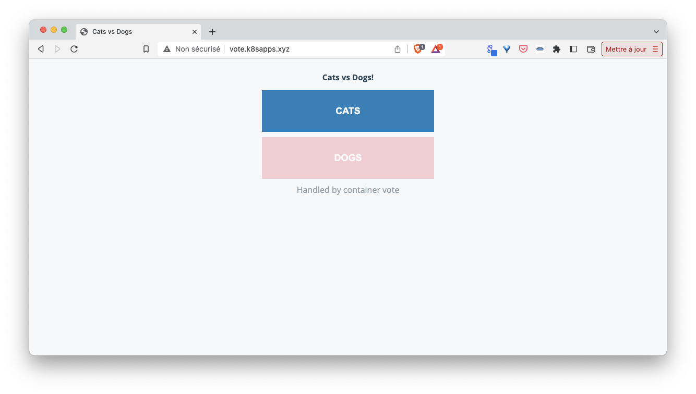
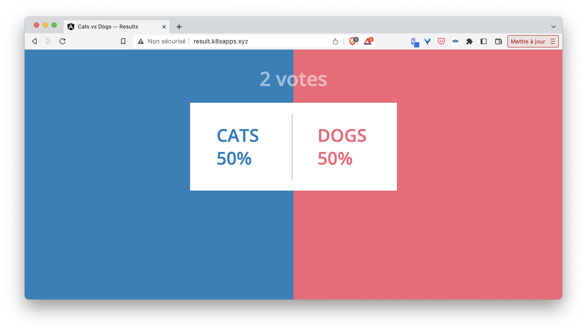

In this step we will show how to use a custom domain to expose the VotingApp Acorn application.

## About Acorn default domain

When you run the VotingApp in the previous steps, you probably noticed the http endpoints returned use the *oss-acorn.io* domain

To illustrate this, run the VotingApp once again:

```
acorn run -n vote .
```

You will get endpoints similar to the following ones:

- voteui: http://voteui-vote-c7bc34b6.8eovu9.oss-acorn.io
- resultui: http://resultui-vote-f1825499.8eovu9.oss-acorn.io

Using the *dig* command you could see both domain names are resolved to the IP address of your Ingress Controller. 

```
$ dig voteui-vote-c7bc34b6.8eovu9.oss-acorn.io

; <<>> DiG 9.18.12-0ubuntu0.22.04.1-Ubuntu <<>> voteui-vote-c7bc34b6.8eovu9.oss-acorn.io
;; global options: +cmd
;; Got answer:
;; ->>HEADER<<- opcode: QUERY, status: NOERROR, id: 51349
;; flags: qr rd ra; QUERY: 1, ANSWER: 1, AUTHORITY: 0, ADDITIONAL: 1

;; OPT PSEUDOSECTION:
; EDNS: version: 0, flags:; udp: 65494
;; QUESTION SECTION:
;voteui-vote-c7bc34b6.8eovu9.oss-acorn.io. IN A

;; ANSWER SECTION:
voteui-vote-c7bc34b6.8eovu9.oss-acorn.io. 377 IN A 192.168.205.2

;; Query time: 151 msec
;; SERVER: 127.0.0.53#53(127.0.0.53) (UDP)
;; WHEN: Tue Jun 20 15:42:11 CEST 2023
;; MSG SIZE  rcvd: 85
```

Note: in the example above, the underlying Kubernetes cluster is a one-node k3s running on a VM which IP is *192.168.205.2*. In your environment you should get IP address on which your own Ingress Controller is published (it can be a local IP or an external IP reachable from the Internet).

By default, the http endpoints have the following format: 

```
CONTAINER_NAME-APPLICATION_NAME-UNIQUE_HASH-CLUSTER_DOMAIN
```

In the current example, this can be splitted as follows:

- container: *voteui*
- application name: *vote*
- unique hash: *c7bc34b6*
- cluster domain: *8eovu9.oss-acorn.io*

Acorn allows to define a custom cluster domain as well as a custom format for the http endpoints as we will see below.

## Defining a custom domain during Acorn installation

When installing Acorn we can specify our own cluster domain instead of the default one (*oss-acorn.io*) using the *--custom-domain* flag. At the same time we can also disabled the dns managed by Acorn as we don't need it with our custom domain. 

First configure Acorn with the following command (you can replace the example domain *k8sapps.xyz* by your own domain name):

```
acorn install --cluster-domain k8sapps.xyz --acorn-dns disabled
```

Next update the application:

```
acorn run -n vote --update .
```

This time you should be returned endpoints with the following format:

- http://voteui-vote-c7bc34b6.k8sapps.xyz
- http://resultui-vote-f1825499.k8sapps.xyz

Endpoints still have the format ```CONTAINER_NAME-APPLICATION_NAME-UNIQUE_HASH-CLUSTER_DOMAIN``` but this time the cluster domain is ```k8sapps.xyz``` (or the one you used) instead of the default one.

Using the *--http-endpoint-pattern* flag in the Acorn installation command, we could define our own format for the http endpoints as well (this is described in the [endpoint patterns documentation](https://docs.acorn.io/running/networking#endpoint-patterns)).  
To illustrate this, let's update the Acorn installation adding the following flag:

```
acorn install --http-endpoint-pattern="{{.Container}}.{{.App}}.{{.ClusterDomain}}"
```

Note: running the *install* command once again only sets the flag specified and keeps the values of the previously configured flags.

Update the Acorn app one more time:

```
acorn run -n vote --update .
```

The changes made above will cause the application to be exposed on the following endpoints:

- http://voteui.vote.k8sapps.xyz
- http://resultui.vote.k8sapps.xyz

On top of this approach, we can also define a domain at launch time as we will see below.

## Defining a domain at runtime

Acorn allows to specify the domain name of a given container directly from the command line. For instance, the following command update the app using the *-p* / *--publish* flag to define the domains for both *voteui* and *resultui* containers:

```
acorn run -n vote -p vote.k8sapps.xyz:voteui -p result.k8sapps.xyz:resultui --update .
```

On top of the endpoints generated above we also get the ones defined in the run command:

- http://vote.k8sapps.xyz / http://voteui.vote.k8sapps.xyz
- http://result.k8sapps.xyz / http://resultui.vote.k8sapps.xyz

To access the application using the endpoints *http://vote.k8sapps.xyz* and *http://result.k8sapps.xyz*, you can either:

- change the */etc/hosts* of your machine ensuring both domains (*vote.k8sapps.xyz* and *result.k8sapps.xyz*) resolve to the IP address of your Ingress Controller

Example of changes that can be done to the */etc/hosts* (your IP address will be different): 
```
192.168.205.2 vote.k8sapps.xyz
192.168.205.2 result.k8sapps.xyz
```

- change the setting of your own DNS if you have access to it

We can then access both frontend using the custom domains.




Note: changing the setting of your DNS only makes sense if our cluster can be reached from the internet

Exposing the application with a custom domain is straightforward as we have seen in this step. In the next part we will see how to add a TLS certificate.

[Previous](./upgrade.md)  
[Next](./tls.md)