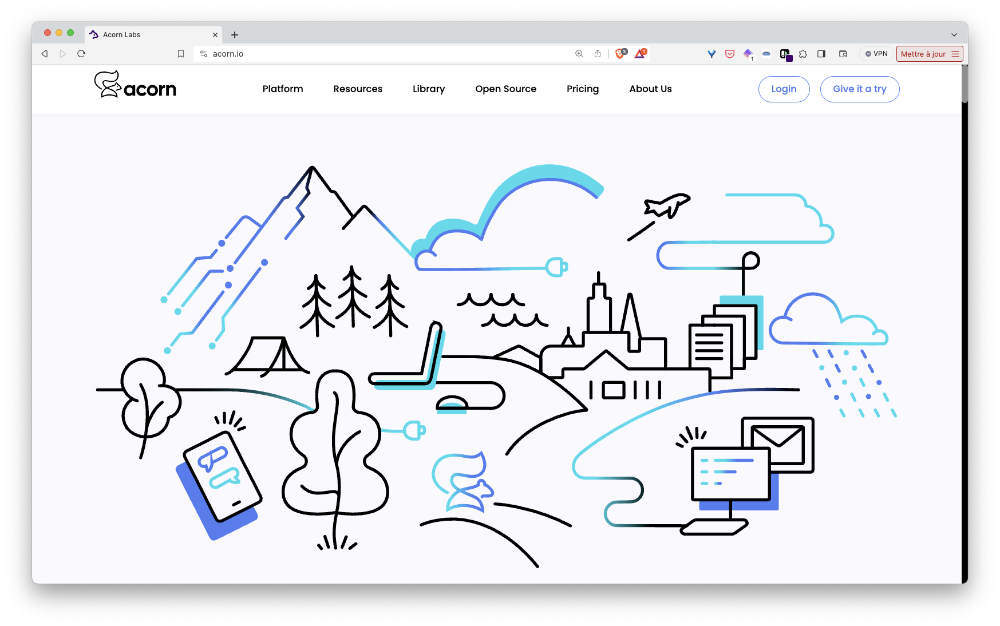

In this step we will present the Acorn Saas platform.

First go to [https://acorn.io](https://acorn.io)



Next login using you GitHub account (this is the only thing you need to create a free account on the Acorn hosted environment)


Once logged you will get to the dashboard


From there you will be able to deploy an Acorn from an existing image or from a service catalog.

Another option is to connect your local acorn cli with the platform and deploy an app from an Acornfile, this is the option we will use in this workshop.

First, go into the *Setup CLI* menu under your profile picture. You will get instruction like the following one:


Next run on your local machine the commands specified:

```
acorn login -p XXXXXXXX
acorn project use acorn.io/lucj/acorn
```

You will get a response similar to the following one:

```
  •  Run "acorn projects" to list available projects
  •  Run "acorn project use acorn.io/lucj/acorn" to set default project
  ✔  Login to acorn.io as lucj succeeded
```

Then check the web UI making sure the status is now *Connected*


Your Acorn cli is now configured and ready to manage containerized applications.

[Previous](./environments.md)  
[Next](./votingapp.md)