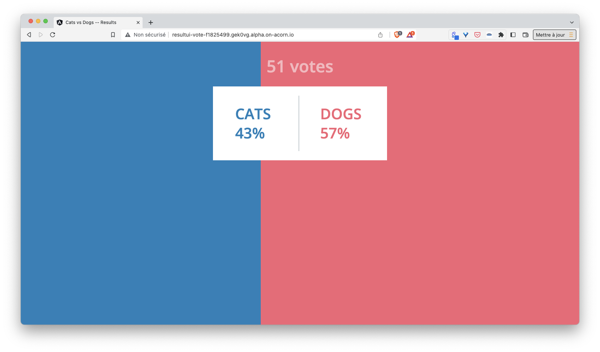

Acorn also allows to define *jobs*. A *job* is used to run a batch job (opposed to a long-running process). A *job* can be run diredtly or scheduled the same way of a standard Linux *cronjob*. In this step you will add a job used to add dummy votes once the application is ready.

Add the following content at the end of your *Acornfile*:

```
jobs: {
    "seed": {
        image: "registry.gitlab.com/voting-application/tools:seed"
    }
}
```

The above content defines a simple job based on the container image *registry.gitlab.com/voting-application/tools:seed*. The code packaged in this image injects 50 random votes inside the redis database.

Run the application using this new version of the *Acornfile*:

```
acorn run -n vote .
```

Using the endpoints of the *resultui* container, you should see additional votes have been added:



In order to run the job only in development mode, modify the Acornfile as follows:

```
if args.dev {
  jobs: {
    "seed": {
      image: "registry.gitlab.com/voting-application/tools:seed"
    }
  }
}
```

First run the application in "normal" mode: you will notice is does not create dummy vote as the job is not triggered.

Next stop the app, run it in "dev" mode and verify dummy votes are added by the job

You can then remove the application and all its dependencies:

```
acorn rm vote --force --all
```

We could also have run the same job according to a schedule. for instance the following defines a job similar to the previous one but which runs every minute:

```
jobs: {
    "seed": {
      image: "registry.gitlab.com/voting-application/tools:seed"
      schedule: "* * * * *"
    }
}
```

<details>
  <summary markdown="span">Acornfile you should have at the end of this step...</summary>
<pre>
labels: {
    application: "votingapp"
}
args: {
    replicas: 3
}
profiles: {
    dev: {
        replicas: 1
    }
    test: {
        replicas: 2
    }
}
containers: {
  voteui: {
    labels: {
      component: "voteui"
    }
    if args.dev {
      dirs: {
        "/usr/share/nginx/html": "./vote-ui"
      }
    }
    build: {
      context: "./vote-ui"
    }
    ports: publish : "80/http"
    scale: args.replicas
    memory: 128Mi
    probes: [
      {
        type: "readiness"
        initialDelaySeconds: 10
        periodSeconds: 5
        http: {
            url: "http://localhost"
        }
      }
    ]
  }
  vote: {
    labels: {
      component: "vote"
    }
    build: {
      target: std.ifelse(args.dev, "dev", "production")
      context: "./vote"
    }
    if args.dev {
      dirs: {
          "/app": "./vote"
      }
    }
    ports: "5000/http"
    memory: 128Mi
  }
  redis: {
    labels: {
      component: "redis"
    }
    image: "redis:7.0.5-alpine3.16"
    ports: "6379/tcp"
    dirs: {
      if !args.dev {
        "/data": "volume://redis"
      }
    }
    memory: 128Mi
  }
  worker: {
    labels: {
      component: "worker"
    }
    build: "./worker/go"
    env: {
     "POSTGRES_USER": "secret://db-creds/username"
     "POSTGRES_PASSWORD": "secret://db-creds/password"
    }
    memory: 128Mi
  }
  db: {
    labels: {
      component: "db"
    }
    image: "postgres:15.0-alpine3.16"
    ports: "5432/tcp"
    env: {
      "POSTGRES_USER": "secret://db-creds/username"
      "POSTGRES_PASSWORD": "secret://db-creds/password"
      "PGDATA": "/var/lib/postgresql/data/db"
    }
    dirs: {
      if !args.dev {
        "/var/lib/postgresql/data": "volume://db"
      }
    }
    memory: 128Mi
  }
  result: {
    labels: {
      component: "result"
    }
    build: {
      target: std.ifelse(args.dev, "dev", "production")
      context: "./result"
    }
    if args.dev {
      dirs: {
          "/app": "./result"
      }
    }   
    ports: "5000/http"
    env: {
      "POSTGRES_USER": "secret://db-creds/username"
      "POSTGRES_PASSWORD": "secret://db-creds/password"
    }
    memory: 128Mi
  }
  resultui: {
    labels: {
      component: "resultui"
    }
    build: {
      target: std.ifelse(args.dev, "dev", "production")
      context: "./result-ui"
    }
    if args.dev {
      dirs: {
        "/app": "./result-ui"
      }
    } 
    ports: publish : "80/http"
    memory: std.ifelse(args.dev, 1Gi, 128Mi)
  }
}
secrets: {
    "db-creds": {
        type: "basic"
        params: {
          usernameLength:     7
          usernameCharacters: "a-z"
          passwordLength:     10
          passwordCharacters: "A-Za-z0-9"
        }
        data: {
            username: ""
            password: ""
        }
    }
}
volumes: {
  if !args.dev {
    "db": {
        size: "100M"
    }
    "redis": {
        size: "100M"
    }
  }
}
if args.dev {
  jobs: {
      "seed": {
        image: "registry.gitlab.com/voting-application/tools:seed"
      }
  }
}
</pre>
</details>

Note: you can find more information about jobs in [the documentation](https://docs.acorn.io/authoring/jobs)

[Previous](./probes.md)  
[Next](./projects.md)