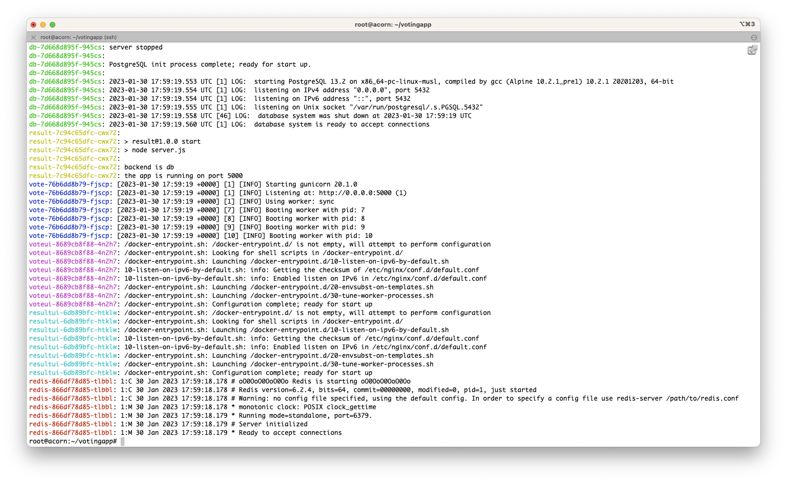
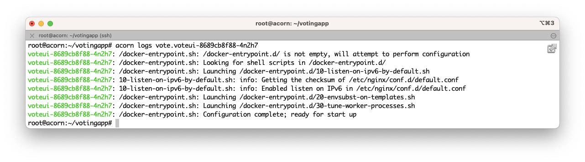
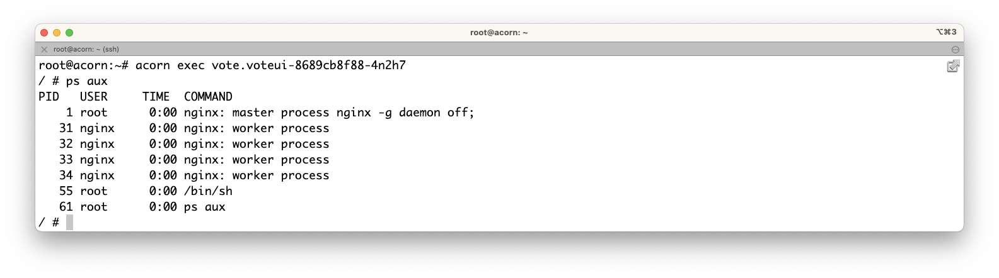

In the previous step you create a first version of the Acornfile for the VotingApp and run the whole application. In the current step you will use several commands to interact with the app, commands which can also help to troubleshoot the app.

## Running the application

Let's run the application once again:

```
acorn run -n vote .
```

If should only take a few tens of seconds for the application to be up and running.

## Inspecting the app

Once the application is running we can have app related information, like the endpoints exposing the app, with the following command:

```
acorn app
```

We can also list the running containers:

```
acorn containers
```

## Getting the logs

Acorn allows us to get the logs of the whole application:

```
acorn logs vote
```




It also allows to get the logs of a single container as illustrated with the following command which get the logs of the *voteui* container (which fullname can be retrieved from the list of containers):

```
acorn logs vote.voteui-8689cb8f88-4n2h7
```



## Running command in a container

From the command line we can launch a command in a running container. The command below runs a *sh* shell in the *voteui* container and list the processes runnning inside that one:

```
acorn exec vote.voteui-8689cb8f88-4n2h7
```



In this step we focused on the application itself and saw how to get information and interact with it. In the next step we will enhance the Acornfile using Acorn secrets.

## Events

Acorn provides the *events* command to get additional information about the running resources:

```
acorn events
```

## Cleanup

## Running the application

Delete the application once again:

```
acorn rm vote
```

[Previous](./acornfile.md)  
[Next](./secret.md)