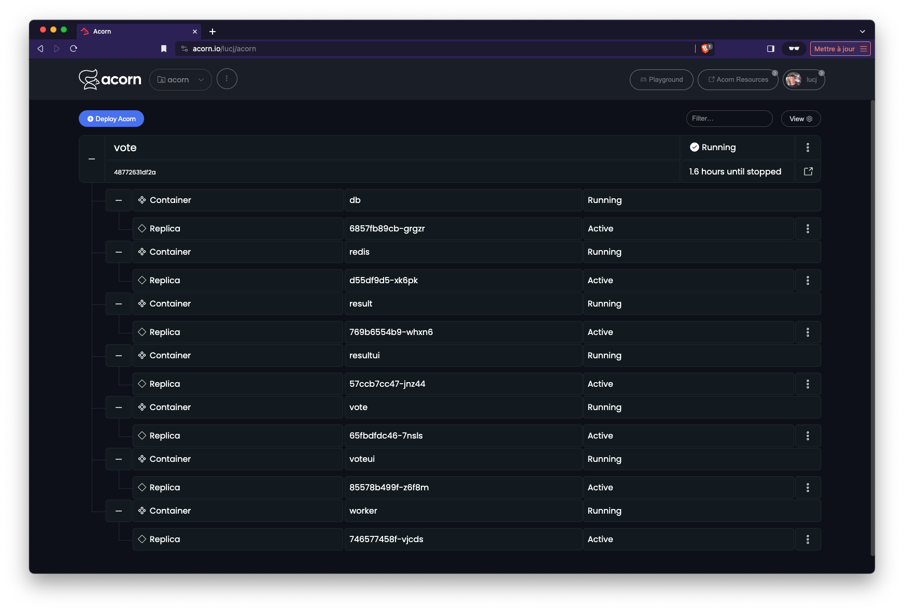
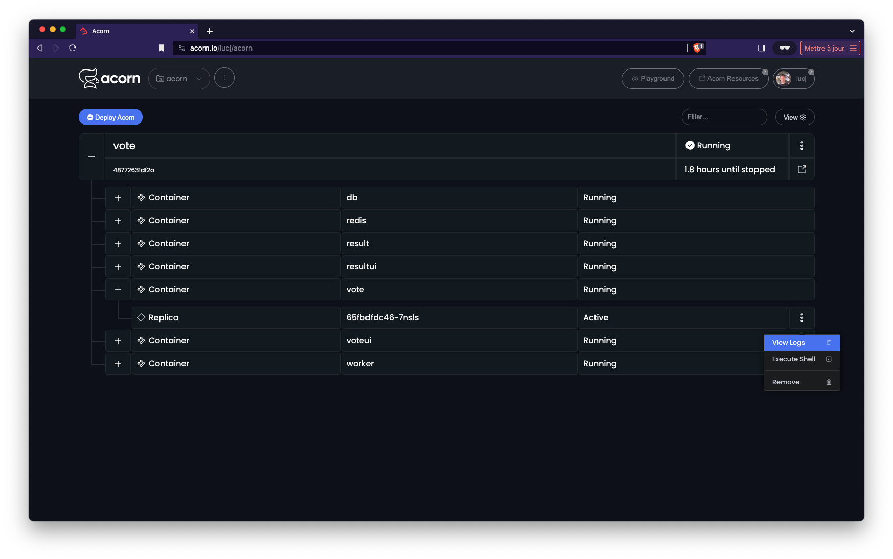
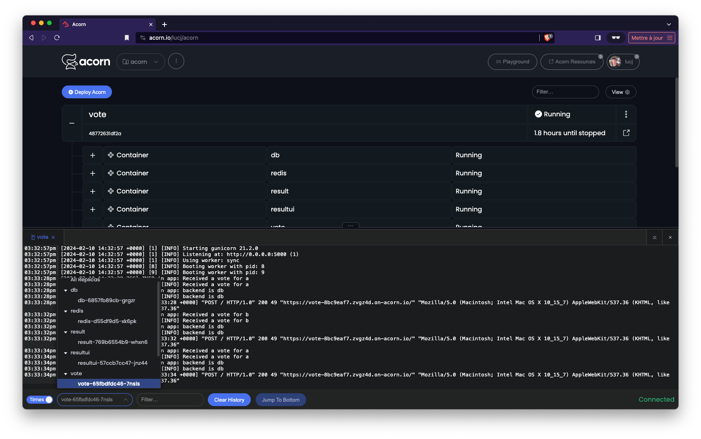
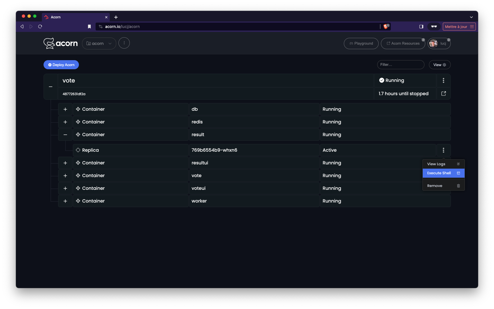
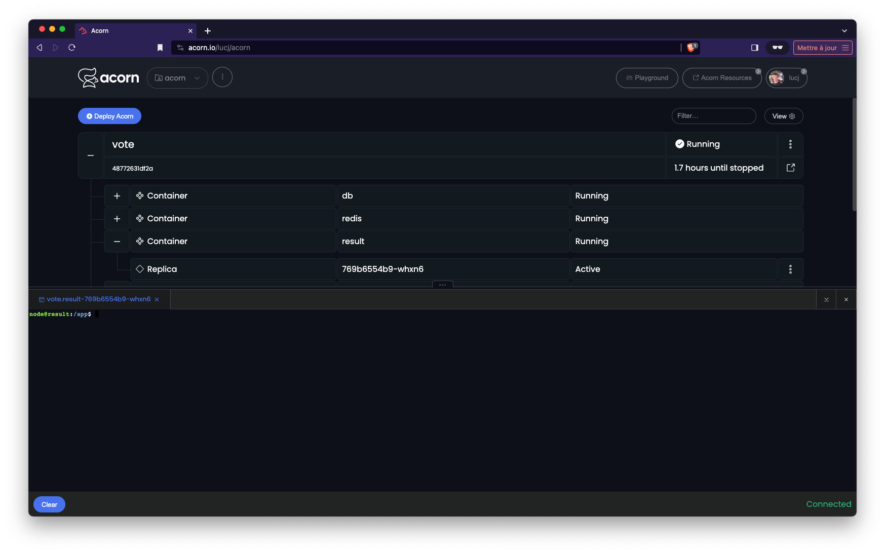
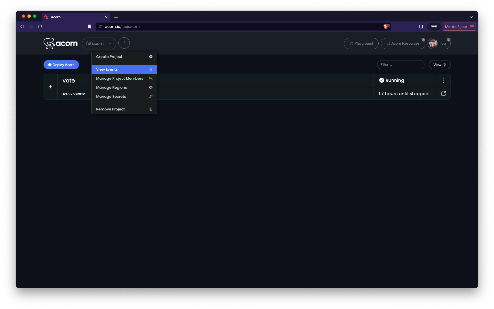
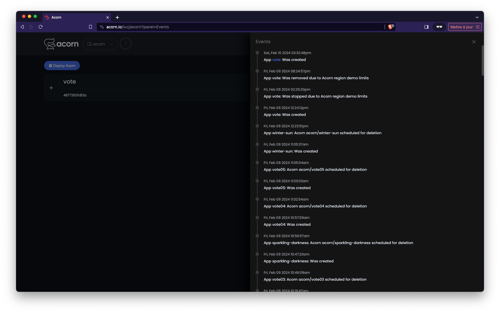
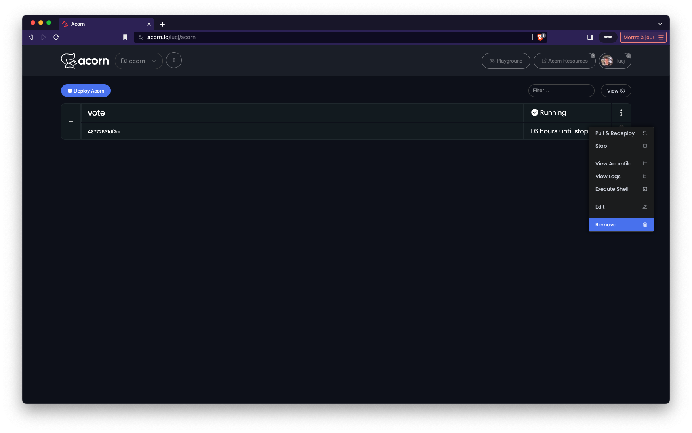

In the previous step you create a first version of the Acornfile for the VotingApp and run the whole application. In the current step you will use several commands to interact with the app, commands which can also help to troubleshoot the app.

## Running the application

Let's run the application once again:

```
acorn run -n vote .
```

If should only take a few tens of seconds for the application to be up and running.

## Inspecting the app

Once the application is running we can have app related information, like the endpoints exposing the app, with the following command:

```
acorn app
```

We can also list the running containers:

```
acorn containers
```

This list of containers can also be see in Acorn saas



## Getting the logs

Acorn allows us to get the logs of the whole application:

```
acorn logs vote
```

It also allows to get the logs of a single container as illustrated with the following command which get the logs of the *voteui* container (which fullname can be retrieved from the list of containers):

```
acorn logs vote.voteui-8689cb8f88-4n2h7
```

You can also see all the logs directly from Acorn Saas selecting a container





This is handy as you can also select the container you want to visualize the logs.

## Running command in a container

From the command line we can launch a command in a running container. The command below runs a *sh* shell in the *voteui* container and list the processes runnning inside that one:

```
acorn exec vote.voteui-8689cb8f88-4n2h7
```

The exec into a container can easily be done from Acorn Saas selecting the container's menu:





## Events

Acorn provides the *events* command to get additional information about the running resources:

```
acorn events
```

These events can also be seen from Acorn Saas selecting the *Views Events* menu from the top drop down





## Cleanup

## Running the application

Delete the application, either using the following command:

```
acorn rm vote
```

or from Acorn Saas




[Previous](./acornfile.md)  
[Next](./secret.md)