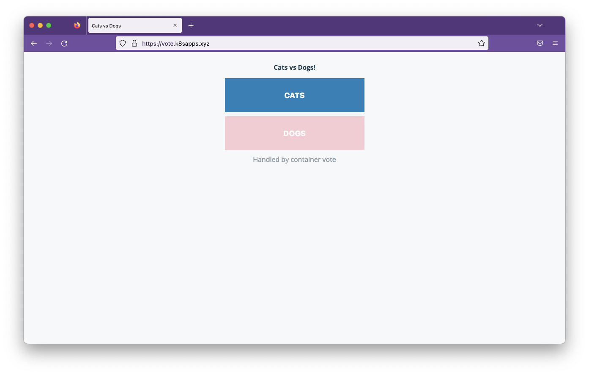
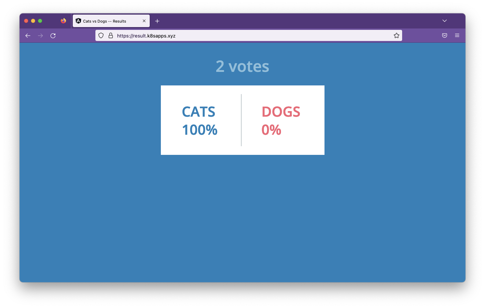

In this step we will show how to expose an Acorn application over https. We will consider 2 cases:
- you are running Acorn on your own cluster
- you are using Acorn Saas platform

## Using Acorn Saas

You already covered, using Acorn Saas your on-acorn.io and custom domains are already served over TLS :)

## Using your own Acorn

----------------------------------------------------------------------------
                                WARNING
To be able to follow the steps below you need:
- a VM accessible from the Internet (eg: a VM created on a cloud provider)
- access to a DNS so you can point your domains to the Ingress Controller IP
----------------------------------------------------------------------------

If you do not have the prerequisites above, please just read along the following steps to undersrtand the main principles.

### Adding a TLS certificate

There are 2 ways to associate a TLS certificate to an Acorn application:
- using cert-manager, a tool wildly used in the ecosystem
- directly using Acorn though its integration with Let's Encrypt

In the following we will focus on the second approach.

### Acorn integration with Let's Encrypt

In order to enabled the Let's Encrypt integration, we need to modify the Acorn installation option as follows (make sure to replace the EMAIL_ADDRESS placeholder with your real email address):

```
acorn install \
  --ingress-class-name traefik \
  --lets-encrypt=enabled \
  --lets-encrypt-tos-agree=true \
  --lets-encrypt-email=EMAIL_ADDRESS
```

Note: as we are running a one node k3s cluster, the *--ingress-class-name* refers to the IngressClass automatically created by Traefik Ingress Controller (deployed by default in k3s)

You should get an output similar to the following one:

```
  •  You've enabled automatic TLS certificate provisioning with Let's Encrypt. This can take a few minutes to configure.
  ✔  Running Pre-install Checks
  ✔  Installing ClusterRoles
  ✔  Installing APIServer and Controller (image ghcr.io/acorn-io/runtime:v0.10.0)
  ✔  Waiting for controller deployment to be available
  ✔  Waiting for API server deployment to be available
  ✔  Waiting for registry server deployment to be available
  ✔  Running Post-install Checks
  ✔  Installation done
```

In order to use the subdomains *vote.YOUR_DOMAIN* and *result.YOUR_DOMAIN* with TLS certificate, you first need to make sure to update the DNS entry so both subdomains are resolved againts the IP of your Ingress Controller. The screenshot below illustrates the configuration on CloudFlare using the domain *k8sapps.xyz* and the IP address of the current Ingress Controller, your domain and IP address will be different though:


We can then update the application:

```
acorn run -n vote -p vote.k8sapps.xyz:voteui -p result.k8sapps.xyz:resultui --update .
```

We will be returned additional https endpoints to access both *voteui* and *resultui* frontends (note: it can take a few tens of seconds for those endpoints to be accessible):

- https://vote.k8sapps.xyz
- https://result.k8sapps.xyz 

We can then access both frontend using the custom domains and via https:





[Previous](./domain.md)  
[Next](./congrats.md)