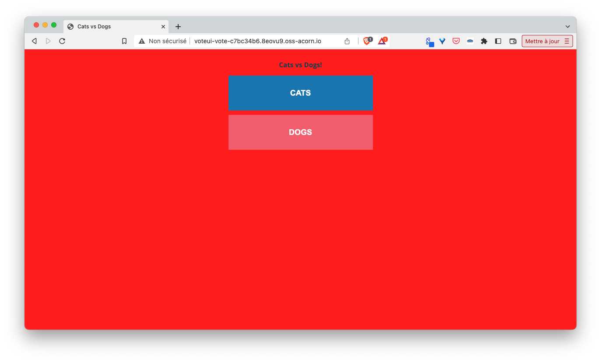

In the previous part you built your own image of the application and sent it to the DockerHub, we will now see how Acorn can be used to automatically upgrade the running application when a new version of the image is available.

First run the application with a SemVer pattern as follows:

Note: replace the placeholder *YOUR_DOCKERHUB_USERNAME* with your actual DockerHub's username

```
acorn run -n vote docker.io/YOUR_DOCKERHUB_USERNAME/acorn-workshop:v#.#.#
```

As usual, you should receive http endpoints to access both *voteui* and *resultui* container.

- vote ui: http://voteui-vote-c7bc34b6f316.5its5i.alpha.on-acorn.io
- result ui: http://resultui-vote-f1825499e037.5its5i.alpha.on-acorn.io

Next modify the application a bit. You can for instance change the color of the *voteui* background modifying the following part in *vote-ui/content/content.css*:

```
...
html,body{
  margin: 0;
  padding: 0;
  background-color: #F7F8F9;      <- this needs to be modified
  height: 100vh;
  font-family: 'Open Sans';
}
```

so it looks as follows:

```
html,body{
  margin: 0;
  padding: 0;
  background-color: red;
  height: 100vh;
  font-family: 'Open Sans';
}
```

Next build the new version of the application specifying *v1.0.1* in the image's tag:

```
acorn build -t docker.io/YOUR_DOCKERHUB_USERNAME/acorn-workshop:v1.0.1 .
```

Then push this new version to the DockerHub:

```
acorn push docker.io/YOUR_DOCKERHUB_USERNAME/acorn-workshop:v1.0.1
```

After a few tens of seconds the running application should be upgraded from *v1.0.0* to *v1.0.1*

- Application still running in version v1.0.0

```
$ acorn app
NAME      IMAGE                                       HEALTHY   UP-TO-DATE   CREATED   ENDPOINTS                                                                                                                                          MESSAGE
vote      index.docker.io/lucj/vote-workshop:v1.0.0   7         7            14m ago   http://resultui-vote-f1825499e037.5its5i.alpha.on-acorn.io => resultui:80, http://voteui-vote-c7bc34b6f316.5its5i.alpha.on-acorn.io => voteui:80   OK
```

- Application now running in version v1.0.1

```
$ acorn app
NAME      IMAGE                                       HEALTHY   UP-TO-DATE   CREATED   ENDPOINTS                                                                                                                                          MESSAGE
vote      index.docker.io/lucj/vote-workshop:v1.0.1   7         7            15m ago   http://resultui-vote-f1825499e037.5its5i.alpha.on-acorn.io => resultui:80, http://voteui-vote-c7bc34b6f316.5its5i.alpha.on-acorn.io => voteui:80   OK
```

Using the http endpoint of the *voteui* container you should now see the new color of the background



Each time a newer SemVer tag is pushed to the registry the application will be upgraded with the new image.

[Previous](./acorn_image.md)  
[Next](./congrats.md)