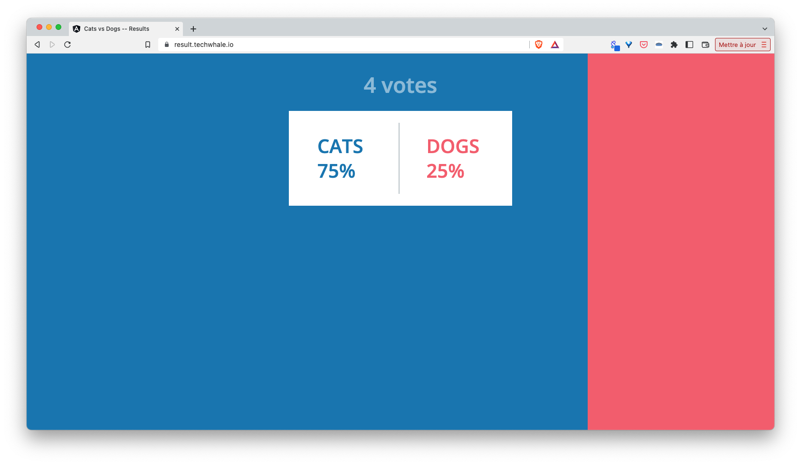
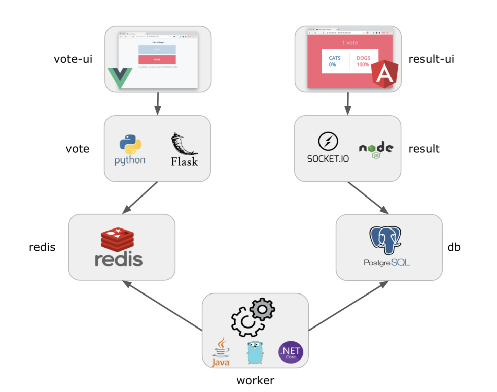

## About the sample application

In this workshop we will use the Voting App, a demo microservices application originally created by Docker. This application uses several languages, different components, and it’s very easy to understand. It basically allows a user to vote from a web interface and to see the results from another one.

Web interface used to select for an item:


Web interface showing the result of the vote:



The application follows the following architecture:



Let's give a quick overview of each microservice of the application:

- vote-ui is a web UI built with VueJS, it allows a user to choose an item between Cats and Dogs
- vote is a backend exposing an API built with Python / Flask
- redis is the database where votes are stored
- worker is a service that retrieves votes from redis and stores the results in a postgres database. Several declinations exist for that microservice: Java, .NET, Go, Rust
- db is the database (based on Postgres) in which the worker consolidates the votes
- result is the backend sending votes to the result-ui via websocket
- result-ui is a web UI built with Angular, it displays the results of the votes

From a shell in the VM you created in the previous step, run the following command to get the code of each microservice:

```
mkdir votingapp
cd votingapp
for s in vote-ui vote worker result result-ui; do 
  git clone https://gitlab.com/voting-application/$s.git;
done
```

In the next step you will create your first Acornfile to specify the application.

[Previous](./environment.md)
[Next](./acornfile.md)