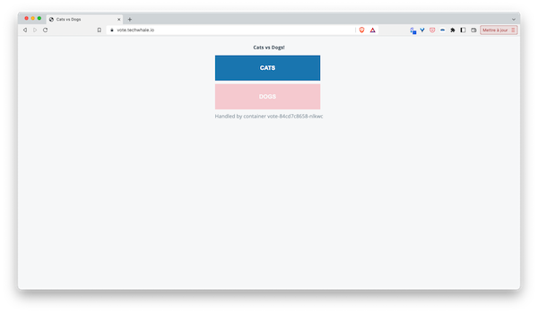
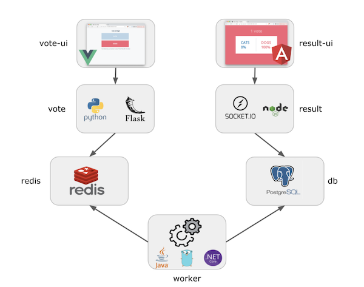

## About the sample application

To demo several features of Acorn we will use the Voting App, a demo microservices application originally created by Docker. This application might not follow all the best architectural patterns but it’s definitely great for demos as it uses several languages, different components, and it’s very easy to understand. It basically allows a user to vote from a web interface and to see the results from another one.

Web interface used to select for an item




Web interface showing the result of the vote


The application follows the architecture below:



Below are the details of each microservice:

- vote-ui is a web UI built with VueJS, it allows a user to choose an item between Cats and Dogs
- vote is a backend exposing an API built with Python / Flask
- redis is the database where votes are stored
- worker is a service that retrieves votes from redis and stores the results in a postgres database. Several declinations exist for that microservice: Java, .NET, Go, Rust
- db is the database (based on Postgres) in which the worker consolidates the votes
- result is the backend sending votes to the result-ui via websocket
- result-ui is a web UI built with Angular, it displays the results of the votes

This app was originally living in a single GitHub repo. In order to enhance it I created a GitLab project inside of which each microservice has its own git repository. 

To prepare the following steps, we create a new folder and clone the application code inside of it:

```
mkdir votingapp
cd votingapp
for s in vote-ui vote worker result result-ui; do 
  git clone https://gitlab.com/voting-application/$s.git;
done
```

In the next step we will see how this application can be defined with Acorn.
